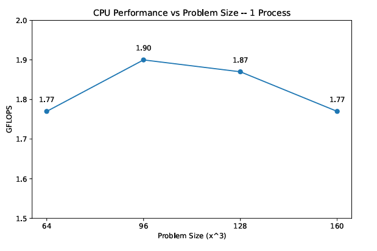
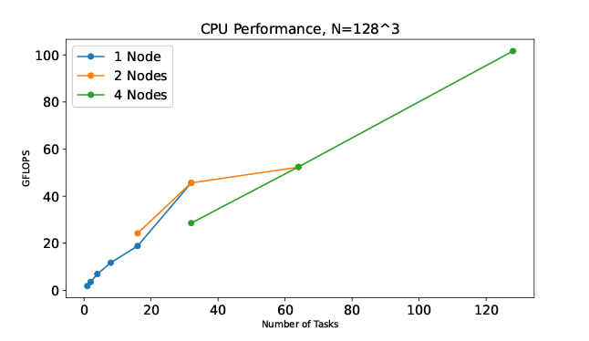
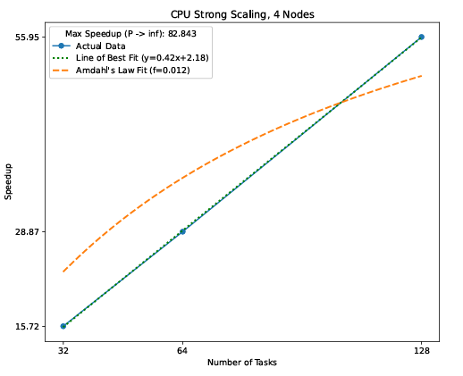
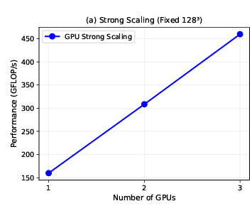
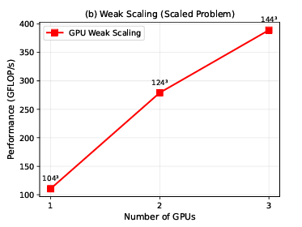
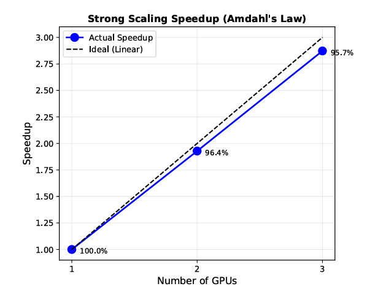
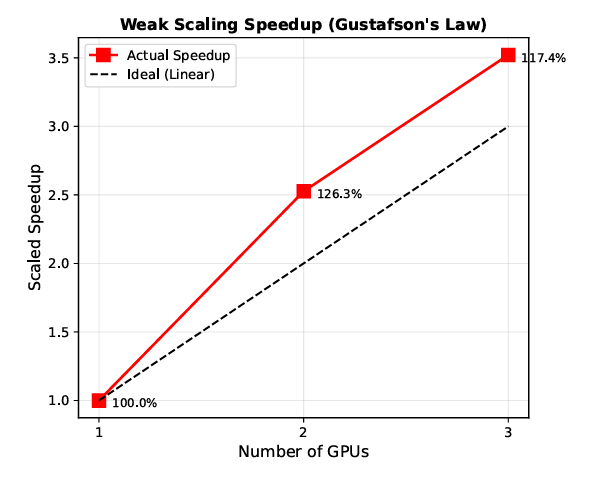
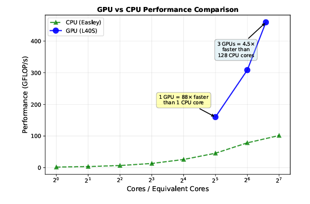
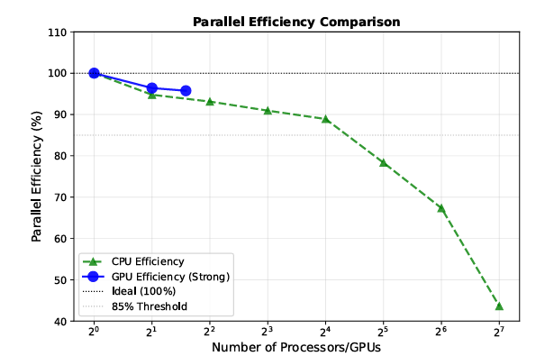

# HPCG Benchmark: GPU vs CPU Scaling on an HPC Cluster

High-Performance Conjugate Gradient (**HPCG**) benchmark analysis on the **Easley HPC Cluster at the University of New Mexico (CARC)**.

This project evaluates **parallel scaling, efficiency, and architecture performance differences** between:

- Multi-node CPU execution
- GPU-accelerated HPCG
- Distributed MPI workloads

The experiments explore **strong scaling, weak scaling, and GPU vs CPU performance characteristics** for sparse linear algebra workloads.

---

# Cluster Architecture

Experiments were executed on the **Easley HPC cluster**.

### GPU Nodes
- NVIDIA **L40S GPUs**
- 48 GB GDDR6 per GPU
- PCIe Gen4
- Partition: `l40s`
- Nodes: `easley055–057`

### CPU Nodes
- Intel **Xeon Gold 6438Y+**
- Up to **64 cores per node**
- InfiniBand interconnect
- Partitions: `general`, `debug`

---

# Technologies Used

- MPI (OpenMPI)
- Slurm Workload Manager
- Apptainer / Singularity containers
- NVIDIA HPC Benchmarks
- HPCG 3.1 reference implementation
- Python (data visualization)

---

# CPU Performance Analysis

### CPU Performance vs Problem Size

Optimal CPU performance occurs near **N ≈ 96³**.



Observations:

- Performance peaks at **1.90 GFLOP/s**
- Larger matrices increase memory pressure
- Indicates cache and memory bandwidth limitations

---

### Multi-Node CPU Scaling



Observations:

- CPU performance improves as more MPI processes are used
- Best CPU performance:

```
101.6 GFLOP/s
128 cores across 4 nodes
```

However, scaling efficiency decreases due to:

- inter-node communication
- NUMA effects
- memory bandwidth limits

---

# CPU Strong Scaling



Strong scaling experiments show:

- Similar serial fraction across node configurations
- Best total speedup achieved using **128 cores**

```
Maximum CPU Speedup: 55.95×
```

Scaling is strongest **within a single node**, where communication overhead is lowest.

---

# GPU Performance

## Strong Scaling (Fixed Problem Size)



Performance increases from:

| GPUs | GFLOP/s |
|-----|---------|
| 1 GPU | 159.98 |
| 2 GPUs | ~308 |
| 3 GPUs | **460** |

Strong scaling efficiency:

```
95.7%
```

Near-linear scaling indicates extremely low serial overhead.

---

## Weak Scaling (Increasing Problem Size)



Weak scaling experiments increase problem size proportionally:

| GPUs | Problem Size |
|-----|--------------|
| 1 | 104³ |
| 2 | 124³ |
| 3 | 144³ |

Results:

```
3.52× speedup
117.6% efficiency
```

Superlinear scaling occurs due to:

- improved cache locality
- increased memory bandwidth utilization
- reduced contention

---

# Strong Scaling Speedup (Amdahl’s Law)



Measured GPU speedup:

| GPUs | Speedup | Efficiency |
|-----|--------|-----------|
| 2 | 1.93× | 96.5% |
| 3 | 2.87× | 95.7% |

The near-linear scaling demonstrates:

- minimal serial fraction
- efficient MPI-GPU communication
- strong memory bandwidth utilization

---

# Weak Scaling Speedup (Gustafson’s Law)



Weak scaling results exceed ideal scaling:

```
126% efficiency (2 GPUs)
117% efficiency (3 GPUs)
```

This superlinear behavior highlights the effectiveness of GPU architectures for memory-bound workloads.

---

# GPU vs CPU Performance



Performance comparison:

| Configuration | Performance |
|---------------|------------|
| 1 CPU core | 1.82 GFLOP/s |
| 128 CPU cores | 101.6 GFLOP/s |
| 1 GPU | 159.98 GFLOP/s |
| 3 GPUs | **460 GFLOP/s** |

Key findings:

- **1 GPU ≈ 88× faster than 1 CPU core**
- **3 GPUs ≈ 4.5× faster than 128 CPU cores**

GPU architectures provide a significant advantage for **sparse linear algebra workloads**.

---

# Parallel Efficiency Comparison



Efficiency comparison:

| Configuration | Efficiency |
|---------------|-----------|
| GPU (2 GPUs) | 96.5% |
| GPU (3 GPUs) | 95.7% |
| CPU (128 cores) | 58% |

GPU efficiency remains stable due to:

- high-bandwidth memory
- single-node communication
- optimized sparse kernels

CPU efficiency degrades with scale due to **communication overhead**.

---

# Fastest HPCG Run

```
Hardware: 3 NVIDIA L40S GPUs
Node: easley055
Problem Size: 128 × 128 × 128
Partition: l40s
Performance: 460 GFLOP/s
Parallel Efficiency: 95.7%
```

This configuration maximized aggregate memory bandwidth while avoiding inter-node communication overhead.

---

# Key Takeaways

- GPU architectures significantly outperform CPU-only HPCG runs.
- Strong scaling efficiency exceeded **95%**.
- Weak scaling efficiency exceeded **100%**.
- GPU acceleration provides dramatic performance advantages for **memory-bound sparse linear algebra workloads**.

---

# Authors

**Yaw Danso**  
GPU experiments, GPU scaling analysis

**Shrey Poshiya**  
Data visualization, figure generation

**Alfredo Navarrete**  
CPU experiments, CPU performance analysis
